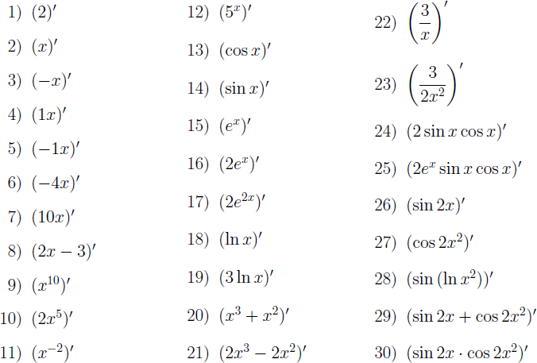

# Домашнее задание №3

Реализуйте процедуру `derivative`, находящую производную функции одной
переменной по правилам дифференцирования. Пусть процедура принимает один
аргумент — выражение на языке Scheme, которой задана функция, и
возвращает также выражение на языке Scheme, соответствующее производной.
Выражения должны быть пригодны для выполнения с помощью встроенной
процедуры `eval`.

Реализуйте нахождение производных константы, линейной, степенной,
показательной (включая экспоненту), натурального логарифма,
тригонометрических функций (синуса и косинуса), а также суммы,
произведения, частного и композиции функций. Не следует ограничивать
число слагаемых в сумме, множителей в произведении и функций в
композиции. Упрощение выражений не требуется.

Ваша процедура должна находить решения по крайней мере следующих
примеров:



Примеры вызова процедуры:

``` scheme
(derivative '(expt x 10)) ⇒ (* 10 (expt x 9))
(derivative '(* 2 (expt x 5))) ⇒ (* 2 (* 5 (expt x 4)))
(derivative (list '* 'x 'x)) ⇒ (+ (* x 1) (* 1 x))
```

Рекомендации:

1.  Выбирайте наиболее общие формулы дифференцирования, обработку
    частных случаев разрабатывайте только при необходимости.

2.  Так как упрощение выражений не предусматривается, вполне приемлемым
    будет результат вычисления, например, вида `(* 3 (/ 1 x))`, или
    `(* 2 (expt x 1))`, или `(* 0 (* 2 (expt x 2)))`.

3.  Разрабатывайте программу через тестирование. Для этого реализуйте
    каркас для юнит-тестирования. На основе приведенных выше примеров
    напишите набор тестов для вашей процедуры и ведите разработку так,
    чтобы добиться правильного выполнения всех тестов. Выполняйте тесты
    после каждого внесения изменений и дополнений в вашу программу.

4.  Предложите способ сделать тесты нечувствительными к способу
    представления результата, где это возможно. Например,
    `(* (exp x) (sin x))` на `(* (sin x) (exp x)))` и `(/ 3 x)`
    `(* 3 (/ 1 x))` должны проходить один и тот же тест.

    ``` scheme
    (define (derivative expr)
    (define (get-denom expr) (caddr expr))
    (define (get-numer expr) (cadr expr))
    (define (get-base expr) (cadr expr))
    (define (get-exponent expr) (caddr expr))
    (let ((current-symbol (if (list? expr) (car expr) expr)))
        (cond ((not (list? expr)) (if (number? expr)
                                    0
                                    (if (symbol? expr)
                                        1)))

            ((null? (cdr expr)) (derivative current-symbol))

            ;; y = x
            ((and (symbol? (cadr expr)) (equal? '- current-symbol)) -1)

            ;; y = number ^ f(x)
            ((equal? 'expt current-symbol)
            (let* ((base (get-base expr))
                    (exponent (get-exponent expr)))
                (if (symbol? base)
                    `(* ,exponent (expt ,base ,(- exponent 1)))
                    `(* ,expr (log ,base) ,(derivative exponent)))))

            ;; y = sin(f(x))
            ((equal? 'sin current-symbol) `(* (cos ,(cadr expr)) ,(derivative (cadr expr))))

            ;; y = cos(f(x))
            ((equal? 'cos current-symbol) `(* (- (sin ,(cadr expr))) ,(derivative (cadr expr))))

            ;; y = log(f(x))
            ((equal? 'log current-symbol) `(/ ,(derivative (cadr expr)) ,(cadr expr)))

            ;; y = f(x) - g(x)
            ((equal? '- current-symbol) `(- ,@(map derivative (cdr expr))))

            ;; y = f(x) + g(x)
            ((equal? '+ current-symbol) `(+ ,@(map derivative (cdr expr))))

            ;; y = f(x) / g(x)
            ((equal? '/ current-symbol)
            (let ((numer (get-numer expr))
                    (denom (get-denom expr)))
                `(/ (- (* ,(derivative numer) ,denom)
                        (* ,(derivative denom) ,numer))
                    (* ,denom ,denom))))

            ;; y = f(x) * g(x)
            ((equal? '* current-symbol)
            (if (null? (cddr expr))
                (derivative (cadr expr))
                (let* ((f (cadr expr))
                        (g (if (null? (cdddr expr))
                                (caddr expr)
                                (cons '* (cddr expr)))))
                    `(+ (* ,(derivative f) ,g)
                        (* ,f ,(derivative g))))))

            ;; y = f(x) ^ number
            ((equal? 'exp current-symbol)
            (let ((deg (cadr expr)))
                `(* (exp ,deg) ,(derivative deg))))

            (else expr))))
    ```

## «Ачивки»

-   Написать функцию `simplify`, упрощающую арифметические выражения:
    умножения на =0= или `1`, сложение с нулём — **+1 балл.**

-   Написать макрос `flatten` (т.е. функцию `flatten`
    из [ДЗ 2](../hw2/hw2.scm) в виде макроса) — **+1 балл.**

-   Написать макрос =mderivative= — **+1 балл.**
