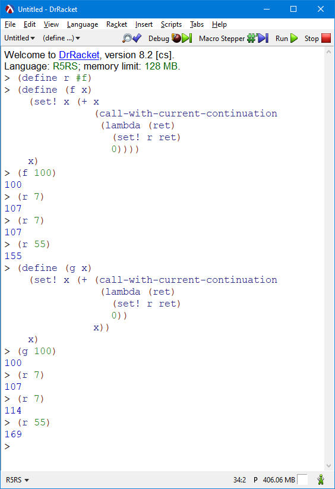

# Домашнее задание №4

## 1. Мемоизация

Реализуйте рекурсивные вычисления с использованием оптимизационных
техник — мемоизации результатов вычислений и отложенных вычислений.

**Важно!** Eсли в программе используются гигиенические макросы и эта
программа будет выполнена в среде guile 1.8.x (в том числе на сервере
тестирования), то следует подключить модуль поддержки таких макросов,
написав в начале программы следующую строку:

``` example
(use-syntax (ice-9 syncase))
```

Реализуйте процедуру *memoized-factorial* для вычисления факториала по
рекурсивной формуле с мемоизацией результатов вычислений. Для мемоизации
используйте ассоциативный список (словарь), который храните в
статической переменной. Использовать для этой цели глобальную переменную
*запрещается.*

Примеры вызова процедур сервером тестирования:

``` example
(begin
  (display (memoized-factorial 10)) (newline)
  (display (memoized-factorial 50)) (newline))

3628800
30414093201713378043612608166064768844377641568960512000000000000
```

``` scheme
(define memoized-factorial
  (let ((cash '()))
    (lambda (n)
      (let* ((args (list n))
             (res (assoc args cash)))
        (if res
            (cadr res)
            (let ((res
                   (cond
                     ((<= n 1) 1)
                     (else (* n (memoized-factorial (- n 1)))))))
              (set! cash (cons (list args res) cash))
              res))))))

(begin
  (display (memoized-factorial 10)) (newline)
  (display (memoized-factorial 20)) (newline)
  (display (memoized-factorial 50)) (newline))
```

## 2. Отложенные вычисления

Используя средства языка Scheme для отложенных вычислений, реализуйте
средства для работы с бесконечными «ленивыми» точечными парами и
списками:

-   Гигиенический макрос *(lazy-cons a b),* конструирующий ленивую
    точечную пару вида *(значение-a . обещание-вычислить-значение-b).*
    Почему макрос в данном случае предпочтительнее процедуры?

    -   Из-за порядка вычислений

        ``` scheme
        (define-syntax lazy-cons
            (syntax-rules ()
                ((lazy-cons a b) (delay (cons a b)))))
        ```

-   Процедуру *(lazy-car p),* возвращающую значение 1-го элемента
    «ленивой» точечной пары *p.*

    ``` scheme
    (define (lazy-car p)
      (car (force p)))
    ```

-   Процедуру *(lazy-cdr p),* возвращающую значение 2-го элемента
    «ленивой» точечной пары *p.*

    ``` scheme
    (define (lazy-cdr p)
      (cdr (force p)))
    ```

-   Процедуру (lazy-head xs k), возвращающую значение k первых элементов
    «ленивого» списка xs в виде списка.

    ``` scheme
    (define (lazy-head xs k)
        (let loop ((xs xs)
                    (new_xs '())
                    (i k))
            (cond ((= i 0) new_xs)
                (else (loop (lazy-cdr xs) (append new_xs (cons (lazy-car xs) '())) (- i 1))))))
    ```

-   Процедуру (lazy-ref xs k), возвращающую значение k-го элементa
    «ленивого» списка xs.

    ``` scheme
    (define (lazy-ref xs k)
        (let loop ((xs xs)
                    (i k))
            (cond ((= i 0) (lazy-car xs))
                (else (loop (lazy-cdr xs) (- i 1))))))
    ```

На их основе определите:

Продемонстрируйте работу процедур на примере бесконечного списка
натуральных чисел. Для этого определите процедуру-генератор (naturals
start), возвращающую бесконечный «ленивый» список натуральных чисел,
начиная с числа start.

Примеры вызова процедур сервером тестирования:

``` example
(display (lazy-head (naturals 10) 12))
(10 11 12 13 14 15 16 17 18 19 20 21)
```

``` scheme
(define (naturals start)
  (lazy-cons start (naturals (+ start 1))))

(display (lazy-head (naturals 10) 12))
```

Реализуйте процедуру (lazy-factorial n), которая возвращает значение n!,
получая его из n-го элемента бесконечного списка факториалов.

Примеры вызова процедур сервером тестирования:

``` example
(begin
  (display (lazy-factorial 10)) (newline)
  (display (lazy-factorial 50)) (newline))

3628800
30414093201713378043612608166064768844377641568960512000000000000
```

``` scheme
(define (lazy-factorial n)
    (define (inner start val)
        (lazy-cons val (inner (+ start 1) (* val (+ start 1)))))
    (lazy-ref (inner 0 1) n))

(begin
  (display (lazy-factorial 10)) (newline)
  (display (lazy-factorial 50)) (newline)
  (display (lazy-factorial  1)) (newline)
  (display (lazy-factorial  2)) (newline)
  (display (lazy-factorial  0)) (newline))
```

## 3. Чтение из потока

Напишите процедуру (read-words), осуществляющую чтение слов, разделенных
пробельными символами, из стандартного потока (порта) ввода (сервер
тестирования направляет в этот поток текстовый файл с примером). Слова в
потоке разделены одним или более пробельными символами. Также пробельные
символы могут присутствовать перед первым словом и после последнего
слова, такие пробельные символы должны игнорироваться. Признак конца
файла означает окончание ввода. Процедура должна возвращать список строк
(один элемент списка — одно слово в строке). Для пустого файла или
файла, содержащего только пробелы, процедура должна возвращать пустой
список.

Анализ потока символов осуществляйте непосредственно при чтении файла,
для чего используйте встроенные процедуры read-char, peek-char,
eof-object? и встроенные предикаты классификации символов.

Пример входных данных (⋅ — пробел, ¶ — конец строки):

``` example
⋅⋅one⋅two⋅three⋅⋅⋅¶ four⋅five⋅⋅six⋅⋅¶
```

Результат вызова процедуры для этих входных данных:

``` example
(read-words) ⇒ ("one" "two" "three" "four" "five" "six")
```

## Решение

``` scheme
(define (read-words)
  (define (concat str1 str2)
    (list->string
     (append (string->list str1) (string->list str2))))

  (let loop ((res '())
             (current-string "")
             (data (read-char)))
    (cond ((eof-object? data) res)
          ((and
            (char? data)
            (char-whitespace? data)
            (not (equal? current-string "")))
           (loop (append res (cons current-string '()))
                 ""
                 (read-char)))
          ((and
            (char? data)
            (char-whitespace? data)
            (equal? current-string ""))
           (loop res
                 current-string
                 (read-char)))
          ((and
            (char? data)
            (not (char-whitespace? data)))
           (loop res (concat current-string (make-string 1 data)) (read-char))))))

(with-output-to-file "home4.test" (lambda ()
                                   (display "  one two three\n four five  six  \n")))
(with-input-from-file "home4.test" (lambda ()
                                    (write (read-words))))
```

## 4. Структуры (записи)

Используя средства языка Scheme для метапрограммирования, реализуйте
каркас поддержки типа данных «структура» («запись»). Пусть объявление
нового типа «структура» осуществляется с помощью вызова (define-struct
тип-структуры (имя-поля-1 имя-поля-2 … имя-поля-n). Тогда после
объявления структуры программисту становятся доступны:

-   Процедура — конструктор структуры вида (make-тип-структуры
    значение-поля-1 значение-поля-2 … значение-поля-n), возвращающий
    структуру, поля которой инициализированы перечисленными значениями.
-   Предикат типа вида (тип-структуры? объект), возврщающая #t если
    объект является структурой типа тип-структуры и #f в противном
    случае.
-   Процедуры для получения значения каждого из полей структуры вида
    (тип-структуры-имя-поля объект).
-   Процедуры модификации каждого из полей структуры вида
    (set-тип-структуры-имя-поля! объект новое-значение).

Пример использования каркаса:

``` example
(define-struct pos (row col)) ; Объявление типа pos
(define p (make-pos 1 2))     ; Создание значения типа pos

(pos? p)    ⇒ #t

(pos-row p) ⇒ 1
(pos-col p) ⇒ 2

(set-pos-row! p 3) ; Изменение значения в поле row
(set-pos-col! p 4) ; Изменение значения в поле col

(pos-row p) ⇒ 3
(pos-col p) ⇒ 4
```

Рекомендация. Для более короткой записи решения можно (но не
обязательно) использовать квазицитирование (quasiquotation).

Важно! Если в программе используются гигиенические макросы и эта
программа будет выполнена в среде guile 1.8.x (в том числе на сервере
тестирования), то следует подключить модуль поддержки таких макросов,
написав в начале программы следующую строку:

``` example
(use-syntax (ice-9 syncase))
```

``` scheme
(define-syntax define-struct
  (syntax-rules ()
    ((_ sym-name sym-fields)
     (let loop ((name (symbol->string 'sym-name))
                (fields (map symbol->string 'sym-fields))
                (i 2))
       (if (null? fields)
           (eval `(begin (define (,(string->symbol (string-append "make-"
                                                                  name))
                                  . vals)
                           (list->vector (cons '_struct (cons 'sym-name vals))))
                         (define (,(string->symbol (string-append name
                                                                  "?"))
                                  obj)
                           (and (vector? obj)
                                (> (vector-length obj) 2)
                                (eqv? '_struct (vector-ref obj 0))
                                (eqv? 'sym-name (vector-ref obj 1)))))
                 (interaction-environment))
           (begin (eval `(begin (define (,(string->symbol (string-append name
                                                                         "-"
                                                                         (car fields)))
                                         obj)
                                  (vector-ref obj ,i))
                                (define (,(string->symbol (string-append "set-"
                                                                         name
                                                                         "-"
                                                                         (car fields)
                                                                         "!"))
                                         obj
                                         val)
                                  (vector-set! obj ,i val)))
                        (interaction-environment))
                  (loop name (cdr fields) (+ i 1))))))))

(load "../lab3/lab3.scm")

(define-struct pos (row col)) ; Объявление типа pos
(define p (make-pos 1 2))     ; Создание значения типа pos

(define struct-tests
  (list (test (pos? p) #t)
        (test (pos-row p) 1)
        (test (pos-col p) 2)
        (test (begin
                (set-pos-row! p 3)
                (set-pos-col! p 4)
                (pos-row p))
              3)
        (test (pos-col p) 4)))

(run-tests struct-tests)
```


## 5. Алгебраические типы данных

Используя средства языка Scheme для метапрограммирования, реализуйте
каркас поддержки алгебраических типов данных.

Алгебраический тип данных — составной тип, получаемый путем комбинации
значений других типов (полей) с помощью функций-конструкторов. Такой тип
допускает различные комбинации полей — варианты. Для каждого из
вариантов предусматривается свой конструктор. Все варианты типа
рассматриваются как один полиморфный тип. Функции (процедуры),
работающие с алгебраическим типом, предусматривают отдельные ветви
вычислений для каждого из вариантов.

Пример. Необходимо вычислять периметры геометрических фигур (квадратов,
прямоугольников, треугольников) и длины окружностей. Для этого в
программе определен тип фигура, который может принимать значения
квадрат, прямоугольник, треугольник, окружность. Значения создаются с
помощью конструкторов (для каждой фигуры — свой конструктор) — процедур,
принимающих в качестве аргументов длины сторон (1, 2 или 3 аргумента
соответственно) или радиус (для окружности) и возвращающих значение типа
фигура:

``` example
; Определяем тип
;
(define-data figure ((square a)
                    (rectangle a b)
                    (triangle a b c)
                    (circle r)))

; Определяем значения типа
;
(define s (square 10))
(define r (rectangle 10 20))
(define t (triangle 10 20 30))
(define c (circle 10))

; Пусть определение алгебраического типа вводит
; не только конструкторы, но и предикат этого типа:
;
(and (figure? s)
    (figure? r)
    (figure? t)
    (figure? c)) ⇒ #t
```

Функция расчета периметра или длины окружности — единая для всех фигур,
принимает значение типа фигура и возвращает значение, вычисленное по
формуле, выбранной в соответствии с вариантом фигуры:

``` example
(define pi (acos -1)) ; Для окружности

(define (perim f)
  (match f
         ((square a)       (* 4 a))
         ((rectangle a b)  (* 2 (+ a b)))
         ((triangle a b c) (+ a b c))
         ((circle r)       (* 2 pi r))))

(perim s) ⇒ 40
(perim r) ⇒ 60
(perim t) ⇒ 60
```

Здесь `match` — сопоставление с образцом. В данном примере при
вычислении `(perim s)` значение `s` будет сопоставлено с образцом
`(square a)`. При этом будет осуществлена подстановка фактического
значения `a`, содержащегося в `s`, на место а в выражении `(* 4 a)`
справа от образца. Вычисленое значение будет возвращено из конструкции
`match`.

**Рекомендации.** Для более короткой записи решения можно (но не
обязательно) использовать квазицитирование (quasiquotation). По
литературе и ресурсам Интернет ознакомьтесь с тем, как работает
сопоставление с образцом в других языках программирования.

## Решение

``` scheme
(define-syntax define-data
  (syntax-rules ()
    ((_ name func-constructors)
     (let ((data-name (symbol->string 'name)))
       (begin 
         (eval `(define (,(string->symbol (string-append
                                           data-name
                                           "?"))
                         obj)
                  (and
                   (list? obj)
                   (> (length obj) 0)
                   (equal? 'data (car obj))
                   (equal? 'name (cadr obj))))
               (interaction-environment))
         (let make-cons ((funcs 'func-constructors))
           (if (not (null? funcs))
               (begin
                 (eval `(define (,(caar funcs) . args)
                          (append (list 'data (string->symbol ,data-name) ',(caar funcs)) args))
                       (interaction-environment))
                 (make-cons (cdr funcs))))))))))


(define-syntax match
  (syntax-rules ()
    ((match value ((name args ...) expr))
     (apply (lambda (args ...)
              expr)
            (cdddr value)))
    ((match value ((name args ...) expr) patterns ...)
     (if (equal? 'name (caddr value))
         (apply (lambda (args ...)
                  expr)
                (cdddr value))
         (match value patterns ...)))))

;; Определяем тип
(define-data figure ((square a)
                     (rectangle a b)
                     (triangle a b c)
                     (circle r)))

;; Определяем значения типа
(define s (square 10))
(define r (rectangle 10 20))
(define t (triangle 10 20 30))
(define c (circle 10))

(display (and (figure? s)
              (figure? r)
              (figure? t)
              (figure? c)))
(newline)

(define pi (acos -1)) ;; Для окружности

(define (perim f)
  (match f
         ((square a)       (* 4 a))
         ((rectangle a b)  (* 2 (+ a b)))
         ((triangle a b c) (+ a b c))
         ((circle r)       (* 2 pi r))))

(display (perim s))
(newline)
(display (perim r))
(newline)
(display (perim t))
(newline)
(display (perim c))
(newline)
```

## «Ачивки»

-   Объяснить, как и почему работает следующий фрагмент кода:

-   Написать макросы `my-let` и =my-let\*= без использования эллипсисов
    (многоточий, `...`) (и, конечно, встроенных `let`, `let*`, `letrec`)
    **+1 балл** за оба.

-   Объяснить, почему от перемены мест слагаемых меняется сумма в этом
    примере **(1 балл):** 
